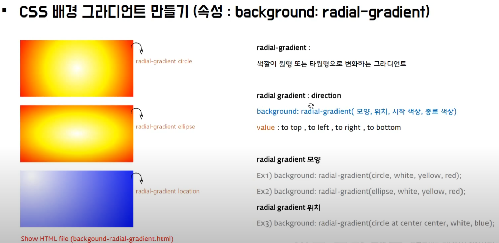
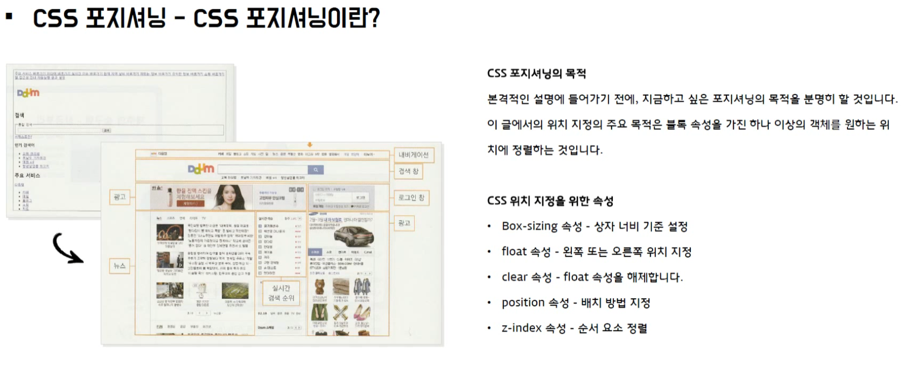

# 1. 반드시 외워야 하는 특수 기호 영어 표현


# 2. 커리큘럼


# 3.레이아웃 디자인 설계 순서

```
- 와이어프레임 : 박스 그리기
-
```

# 4. CSS 기본 문법 / CSS 링크 방법

```
- Selector(선택자) : html body 와 body 사이의 element를 선택
```

# 5. CSS 선택자 - 태그, 클래스, 아이디, 하위, 그룹, 전체 선택자

```
- css의 선택자와 선택자 사이의 space는 하위 선택자를 말한다.
- ',' 를 이용하여 그룹으로 묶어준다. (중복된 속성을 제거)
```
# 5-1. 선택자의 적용 우선 순위


# 6. CSS 폰트 사이즈 단위 (고정 px pt / 상대적 % em rem)


```
- body font size css 적용시 h1~h6은 제외된다.
- 일반적으로 웹페이지는 14px 로 한다.
- font size를 지정하지 않으면 16px 이다.
- line-height 는 보통 1.5 ~ 1.6em 으로 한다.
  px 이용시 font size가 커지면 line-height도 변경을 해야 한다.
  하지만 em 을 사용하면 상대적이기때문에 자동으로 font-size가 커져도 line-height를 조정하지 않아도 된다.
- font-variant 는 영문에만 해당 된다.
- text-show 사용시 shadow를 여러개 주고 싶다면 ',' 로 구분하면 된다.
```

# 7. CSS 목록 스타일

```
- 주로 네비게이션을 만들때 사용한다.
```
# 8. CSS 목록 실전 예제
## 8.1 figure 태그로 만드는 리스트 스타일

```
- figure : html5에서 지원하는태그
```

## 8.2 CSS 배경 색상 및 이미지 제어


```
- rgb : 0, 0, 0 : black
  rgb : 255, 255, 255 : white
- rgba : a - alpha 값 : 투명도 조절
- background-size: cover 는 요소의 크기가 변해도 여백을 남기지 않는다.
- background-position: 가로 세로 일때 가로 옆에 px, %를 넣으면 해당 값에 먹는다.
  ex) bottom 10% center -> bottom 10%, center와 같다.
- background-attachement : 배경 이미지리르 고정하기위해 사용
```

# 9. CSS 레이아웃 스타일
## 9.1 Block elements & Inline elements

```
- Block Element
  1) 너비값, 높이값 가질수 있음.
  2) 세로로 계속 추가된다.
  4) 가로로 표시
     * float: left; - 하위까지 영향을 줌
     * display: line-block; 해당 태그에만 영향

- Inline Element
  1) 너비값, 높이값 가질수 없음.
  2) 가로로 계속 추가된다.
  3) image는 inline element 이지만 유일하게, width, height, margin 이 실행된다.

```
## 9.2 Box Model


```
- border: 2px solid red; 아래와 같다. (한줄로 표현)
  = border-width: 2px;
    border-color: red;
    border-style: solid;
- border-radius 를 이용하여 원을 만드려면, width, height 값이 같아야 한다.
- box 안에서의 text를 중앙에 위치 시키려면, line-height 를 이용한다.
  box의 height 값을 line-height 의 값과 같게 하면 된다.
```
## 9.3 Box Shadow

```
- inset box-shadow 속성을 안쪽으로 가져온다.
```

# 10. CSS 테이블 스타일

```
- td padding은 기본적으로 3px ~ 5px 를 준다.
```
# 11. CSS 배경 그라디언트



```
- 참고 사이트
   https://mycolor.space/gradient
   http://www.colorzilla.com/gradient-editor
   https://www.cssmatic.com/gradient-generator
```

# 12. CSS 포지셔닝


## 12.1 float

```
- float 다음에 나오는 요소는 상위 float 속성의 영향을 받는다.
```
## 12.1 position


### 12.1.1 fixed


### 12.1.2 absolute

```
- body는 기본 margin 을 갖고 있다. 만약 margin 을 제거하고 싶다면
  body {
    margin: 0;
  }
  을 해주어야 한다.
- transform 을 사용해야 실제 박스가 중앙에 온다.
```

### 12.1.2 z-index, visibility, opacity, display

```
- z-index : 숫자가 높은것이 맨앞으로
  -1은 맨 뒤로 보냄.
- visibility : 사라지게 하지만 공간은 남음
- opacity : 사라지는게 아니라 fade out 됨.
- display: 사라지면서 공간도 없어짐.
```

### 12.1.3 relative & absolute

```
- body 태그만은 position relative는 예외
- div가 계층구조 즉,
  div > div 일경우 상위 div에 postion: relative 속성이 있어야
  하위 div에서 position: absolute가 상위 div에 종속이 된다.
  즉, 부모 자식관계가 이루어진다.
```

# 13. 실전 예제
