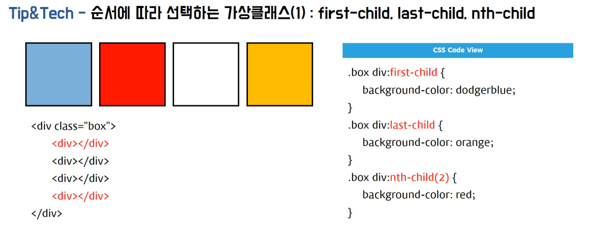

# display 속성의 모든것 (외우자!)

```
- 인라인 요소(inline elements)
  대부분 서식 관련
- 블록 요소 (block elements)
  전체적으로 레이아웃을 잡기 위한 태그
- 인라인 블록(inline-block elements)
- margin 겹침 현상
  상하에만 겹침 현상이 있음.
```

# 기본 필수 선택자
```
- HTML Tag vs HTML Elements
  Tag : h1, h2, h3~
  Elements : HTML Document에 사용된 Tag
- selector : CSS 관련
- 결합 선택자 :
     space : 자손선택자(하위선택자)
     '>'   : 자식선택자 (바로 하위 선택자)
     ','   : 연결 선택자 or 그룹 선택자
```

# CSS 중앙 정렬
```
- 자기 자신이 중앙으로 갈 경우
  position, margin: auto
- 부모요소가 자식요소를 중앙으로 보낼 경우
  flex, grid, placeitems
- 수평 중앙 정렬할 때 블록 요소 vs 인라인(인라인 블록)
  블록요소는 자기 자신에 margin: auto;
  인라인(인라인 블록)는 부모요소 또는 상위요소에 text-align: center;
  float로 배치하는 것은 블록요소, 인라인, 인라인블록 모두 해당됨
- 자기 자신과 인접해 있는 요소와 수직 중앙을 맞출 경우
   text 일때.. 유용
  vertical-align: 값; transform: translateY(값)

- 수평중앙 : justify-content: center;
- 수직중앙 : align-item: center;
- 수직/수평 중앙 :
    display: grid에서 사용
    place-items: center;
```

# 1. 순서에 따라 선택하는 가상 클래스

```
- 가상 클래스
  CSS Selector의 확장 기능
  : 을 이용하여 가상 클래스를 적용한다. (css2 버전)
  :: (css3 버전)
  중간에 box가 추가가 되어도 따로 변경하지 않아도 된다.
  nth-child의 순서는 첫번째부터이다.
```


# 2. 마우스 오버와 클릭 스타일 변경하는 가상 클래스: hover, focus


# 3. 가변영역 고정영역 함께 사용하는 레이아웃 : calc, flex-box, table-layout

```
- calc 속성에서 계산을 할때 space를 주어야 한다.
  calc(100%-300px) -> calc(100% - 300px)
- Venderprefix : 모든 브라우저에서 정상적으로 출력 (옵션)
  width: -webkit-calc(100% - 300px);
  width: -moz-calc(100% - 300px);
  width: -o-calc(100% - 300px);
  width: -ms-calc(100% - 300px);
- 예제
  class-layout-01.htm
```

# 4. inline-block에 생기는 마신 없애기


# 5. div 또는 background color 높이를 100%로 브라우저에 가득 채우기

```
- body는 width, height 는 100% 다.
- background: linear-gradient(to right bottom, dodgerblue, orange)
  html {
    height: 100%
  }

  로 해줘야 한다. 즉, 하위요소에 linear-gradient를 사용하면 부모에 height 를 설정해야 한다.
```

# 6. 수직수평 중앙정렬 시키는 방법 (몸이 기억하도록 해야함)

```
- justify-content : center - 가로중앙
  align-items: cetner - 세로 중앙을 말한다.
- 중앙정렬 시키는 방법 (코드가 복잡해져서 잘 사용하지 않는다.)
  display: table      : div를 테이블 처럼 사용하겠다.
  display: table-row  : table > tr
  display: table-cell : table > td
  --
  position: absolute : 항상 절대적인 위치를 차지
  왼쪽 상단 꼭지점을 기준으로 center를 하기때문에 transform: translate 를 이용해야 한다.
  position 을 사용할때는 부모 속성과 페어로 관리해야 한다.
  부모 : postion: relative;
  자식 : postion: absolute;
- example : class-display-02.htm
```
# 7. 높이값 찾아주기


```
- 자식 요소에 float 속성이 있으면 부모요소가 높이 값을 잃는다.
  이때 부모요소의 높이값을 정상적으로 찾아주는 것이 overflow: hidden 이다.
```
# 8. 가상클래스 : before, after, Breadcrumb (활용을 잘하지 못하면 중급으로 올라갈수 없다.)

```
- form element는 before, after는 가상클래스를 가질수 없다.
  즉, form을 구성하는 form, input, button 등...
- 가상클래스에서는 모든것을 할 수 있다.
- awesome 에서 가상 클래스에 값을 넣으려면 unicode를 이용한다.
  이때 unicode 는 역슬레시를 반드시 앞에 넣어주어야 한다.
  ex) .breadcrumb a:after {
        content: '\f105';
        font-fmaily: fontawesome
      }
- 가상클래스 : (css2 버전), ::(css3 버전)
```

# 8. CSS 자손 선택자(space 사용) vs 자식 선택자 ( > 사용)


# 9. Css 속성 선택자

```
- box-sizing: border-box : input에 들어가 있는 늘어난 공간을 잡아주는 것
- 기본형 : 속성 선택자는 태그[속성=값]
  input[type=text]
```