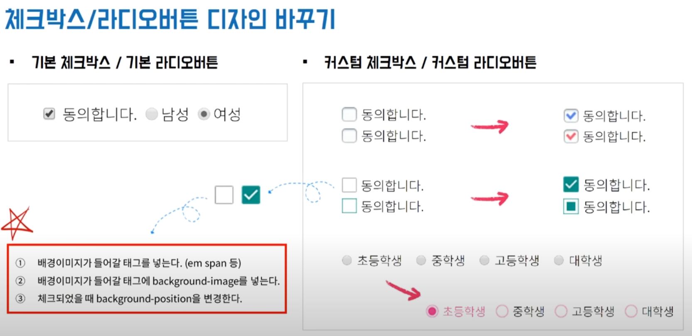

# 1. 커스텀 체크박스/라디오버튼 만들기
> https://lokesh-coder.github.io/pretty-checkbox/
```
- 프리티 체크박스 CSS 링크
- 프리티 체크박스 CSS 클래스 넣기
```
# 2. 체크박스/라디오버튼 디자인 바꾸기

```
- 배경 이미지이고, 포지션이 왼쪽, 오른쪽으로 변경되는 것이다.
- check box 클릭시 lable 클릭시에도 동작을 하게하려면 페어링이 되어야 한다.
  즉, input box 의 아이디와 lable의 for와 연결을 하면 된다.
  ex) <input type="checkbox" id="chk1">
      <label for="chk1">동의합니다.</label>
  또는 <lable> 안에 input 박스를 넣어두면 된다.
  ex) <label>
        <input type="checkbox">동의합니다.
      </label>
- + 인접선택자
  ~ 형제 선택자
```