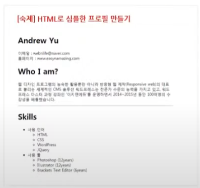
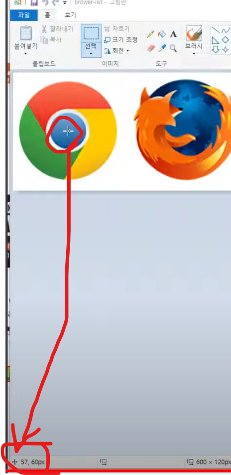
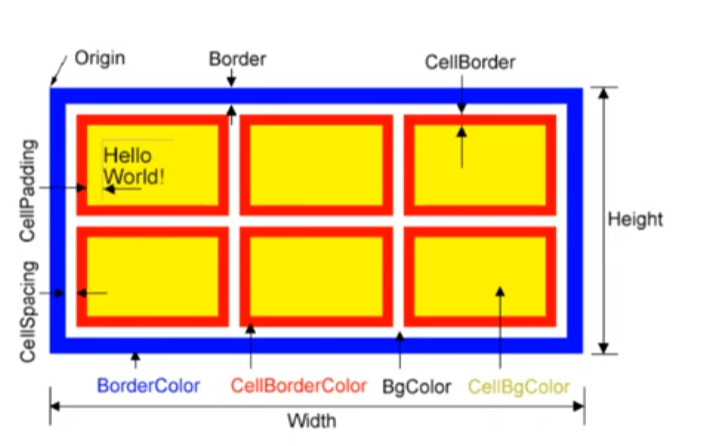

# 정의
```
- HTML은 구조를 만드는 것이고, CSS를 이용하여 꾸미기를 진행한다.
```
# 1. HTML 목록 만들기
```
1) ul, ol 의 속성을 공부하자
2) 중첩시에는 <li></li> 사이에 넣어야 한다. (그래야 제대로된 데이터이다.)
```

## 과제 (test_01.htm 참고)


# 2. Image Map
```
- img 의 usemap 과 map name은 페어링이 되어야 한다.
- 그림판을 이용하여 좌표값을 찾는다.
- 사각형
  왼쪽 상단 (x, y) / 오른쪽 하단 (x, y)
- 원형
  원의 중앙 x, y / 원의 반지름
```


# 3. Table
```
- table, tr, td, th(제목)
  th : 굵은 글자, 중앙 정렬이 기본
- caption 은 table 테그 사이에 있어야 한다.
```


# 4. Span
```
- 구획만 정하는것이지 어떤 역할을 하지는 않는다.
```